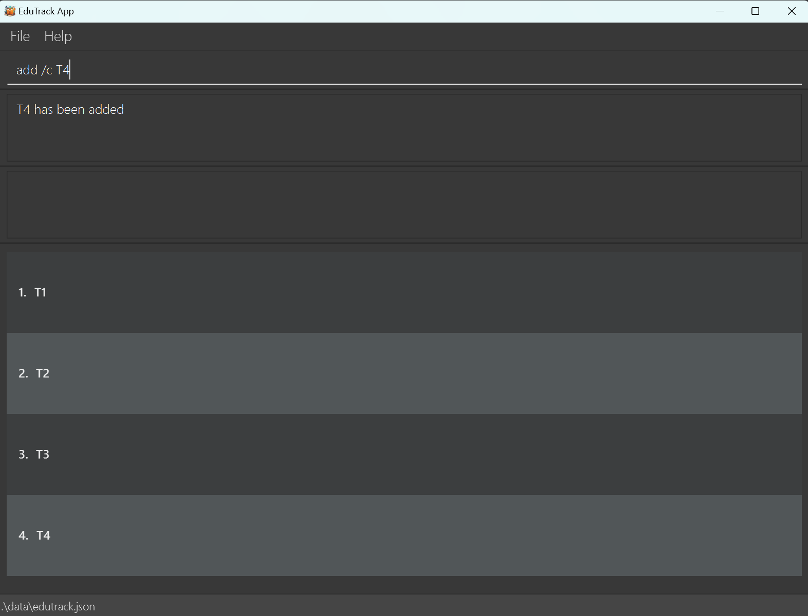

# EduTrack

Sample intended final product:
[](https://github.com/se-edu/addressbook-level3/actions)



### **EduTrack** provides a **centralised system** to help teaching assistants manage multiple classes.<br>
You should expect **EduTrack** to be able to manage:
* Student attendance
* Additional notes for each student
* Student class participation

### Installation:
* Ensure you have java 11 installed in your local computer
* Download the jar file <here>
* Run it!

### Sample usage:
Creating a class
```
add /c cs2103t
```
Adding a new student to the class
```
add /s John /c cs2103t
```
Refer to our [full guide]()  to get a list of commands you can use

### Contributors:
  * Sean
  * Sarah
  * Kota
  * Helin
  * Donovan

  Refer to [AboutUs](https://github.com/AY2324S1-CS2103T-T15-3/tp/blob/master/docs/AboutUs.md) to learn more!

This project is based on the AddressBook-Level3 project created by the [SE-EDU initiative](https://se-education.org).