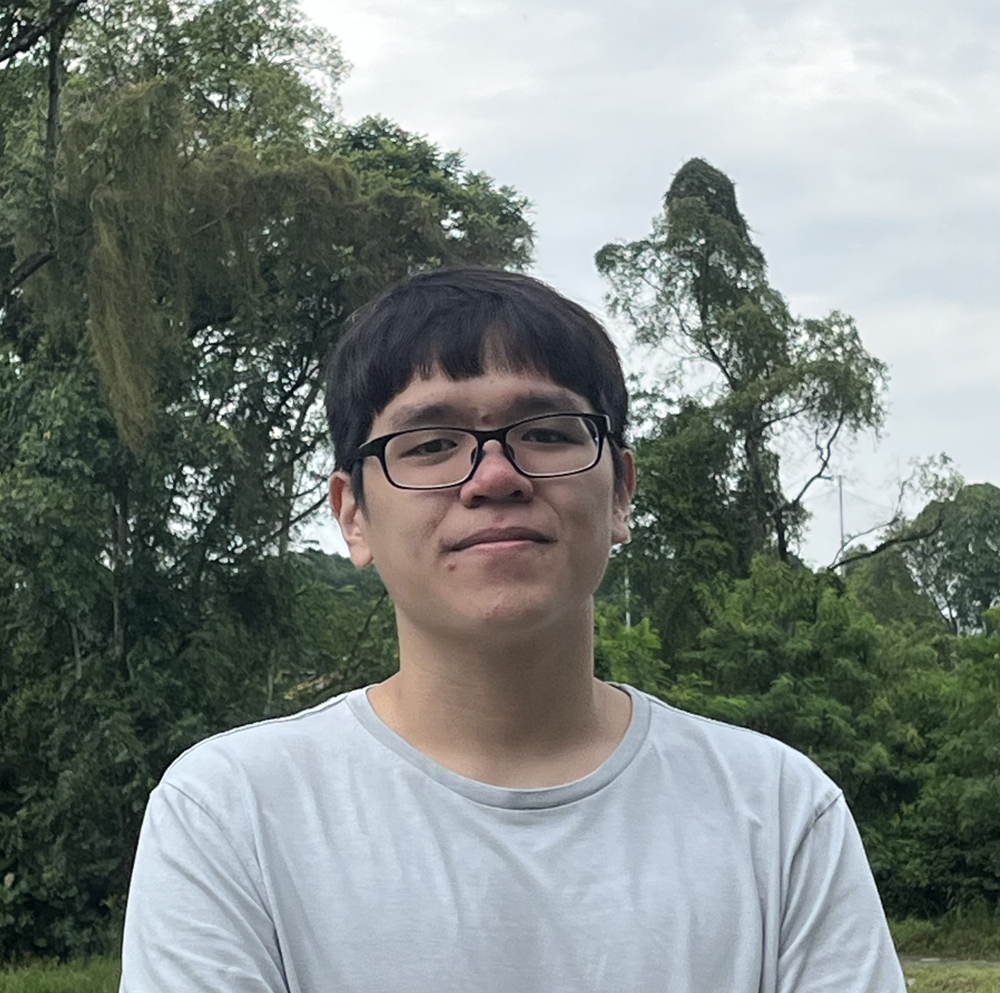

# About Us

We are a team based in the [School of Computing, National University of Singapore](http://www.comp.nus.edu.sg).

You can reach us at the email `seer[at]comp.nus.edu.sg`

## Project team

### John Doe

[[homepage](http://www.comp.nus.edu.sg/~damithch)]
[[github](https://github.com/johndoe)]
[[portfolio](team/johndoe.md)]

* Role: Project Advisor

### Donovan Chan Jia Jun

[[github](http://github.com/donovanjj)]
[[portfolio](team/donovanjj.md)]

* Role: Developer
* Responsibilities: Testing & Scheduling

### Trinh Hoai Song Thu (Sarah)

[[github](http://github.com/songgthu)] [[portfolio](team/songgthu.md)]

* Role: Developer
* Responsibilities: Documentation

### Wang Helin

[[github](http://github.com/revdrag)]
[[portfolio](team/revdrag.md)]

* Role: Developer
* Responsibilities: Integration

### Kota Sudarshan Karanth

[[github](http://github.com/sudarshan2401)]
[[portfolio](team/sudarshan2401.md)]

* Role: Developer
* Responsibilities: Code Quality & Deliverables
