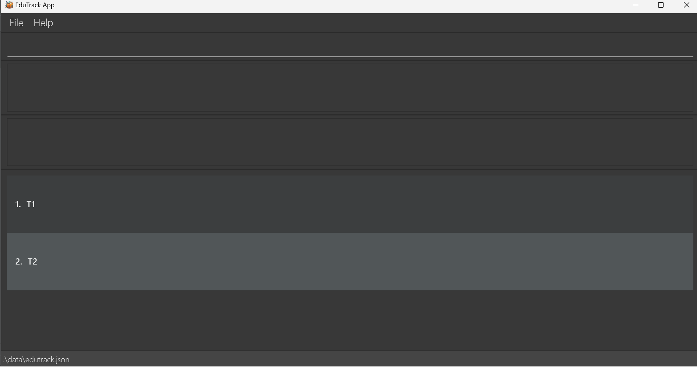

# EduTrack User Guide

EduTrack is a **powerful desktop app designed for SOC tutors**, allowing you to streamline your teaching tasks and effortlessly track your student records.

Whether you find yourself juggling the management of numerous students or simply require swift access to individual student information, EduTrack equips you with the tools to easily organize your classes.

The application is optimized for use via a Command Line Interface (CLI) while still having the benefits of a Graphical User Interface (GUI).

If you are new to this guide, click [here](#about) to find out more about this user guide.

If you are keen to get started on using EduTrack, click [here](#quick-start) for our quick start guide.

---

## Table of Contents

1. [Quick start](#quick-start)
2. [About](#about)
   - [Structure of this user guide](#structure-of-this-user-guide)
   - [Reading this user guide](#reading-this-user-guide)
     - [Common icons](#common-icons)
     - [Common terms](#common-terms)
     - [Command Format](#command-format)
     - [Command Parameters](#command-parameters)
3. [Features](#features)
   - [Class Commands](#class-commands)
     - [Adding a class : `add /c`](#adding-a-class-add-c)
     - [Removing a class : `remove /c`](#removing-a-class-remove-c)
     - [Viewing a class : `view /c`](#viewing-a-class-view-c)
     - [Editing a class: `edit /c`](#editing-a-class-edit-c)
     - [Setting number of lessons of a class: `setlesson /c`](#setting-number-of-lessons-of-a-class-setlesson-c)
     - [Starting a lesson : `startlesson /c`](#starting-a-lesson-startlesson-c)
     - [Marking a student present : `mark`](#marking-your-students-attendance-as-present-mark)
     - [Marking a student absent : `unmark`](#marking-all-students-attendance-in-your-class-as-present-markall)
     - [Marking all students present : `markall`](#marking-your-students-attendance-as-absent-unmark)
   - [Student commands](#student-commands)
     - [Adding a student : `add /s`](#adding-a-student-add-s)
     - [Removing a student : `remove /s`](#removing-a-student-remove-s)
     - [Editing a student : `edit /s`](#editing-a-student-edit-s)
   - [Miscellaneous commands](#miscellaneous-commands)
     - [Viewing help : `help`](#viewing-help-help)
     - [Exiting the program : `exit`](#exiting-the-program-exit)
     - [Saving the data](#saving-the-data)
4. [FAQ](#faq)
5. [Known issues](#known-issues)
6. [Command summary](#command-summary)
7. [Glossary](#glossary)

---

## Quick start

1. Ensure you have Java `11` or above installed in your Computer.
2. Download the latest `EduTrack.jar` from [here](https://github.com/AY2324S1-CS2103T-T15-3/tp/releases).
3. Copy the file to the folder you want to use as the _home folder_ for your EduTrack.
4. Open a command terminal, `cd` into the folder you placed your `EduTrack.jar` file in, and use the `java -jar EduTrack.jar` command to run the application.<br>
   A GUI similar to the below should appear in a few seconds. Note how the app contains some sample data.<br> 
5. Type the command in the command box and press `Enter` to execute it. eg. typing **`help`** and `Enter` again will open the help window.<br>
   Some example commands you can try:
   - `list` : Lists all classes.
   - `view /c 1` : Lists all students in the first class in the list.
   - `add /c CS2103T` : Adds a class named `CS2103T` to the list of classes.
   - `add /s John /c 1` : Adds a student named `John` to the first class in the list.
   - `remove /c 1` : Removes the first class in the list.
   - `exit` : Exits the app.
6. Refer to the [Features](#features) below for details of each command.

---

## About

### Structure of this user guide

This guide is structured in a manner that lets you find what you need fast and easily. To jump to various sections, you can refer to the [Table of Contents](#table-of-contents).

In the following subsection, you can find several tips that could be beneficial when reading this guide. The next section, documents the _main features_ that **EduTrack** offers and provides you instructions on how to use them!

### Reading this user guide

#### Common icons

Here are the common icons that is used throughout this user guide.

**Additional Information**<br>
Text that appear in an information box indicates additional information that is useful to know.

<box type="info">
    **Information:** Example additional information.
</box>

**Caution**<br>
Text that appear in a caution box should be followed carefully, else unintended consequences might arise.

<box type="warning">
    **Caution:** Example warning.
</box>

**Tip**<br>
Text that appear in a tip box are useful for improving your user experience with EduTrack.

<box type="tip">
    **Tip:** Example tip.
</box>

#### Common terms

Here are the common terms that is used throughout this user guide.

| Terms     | Meaning                                                                        |
| --------- | ------------------------------------------------------------------------------ |
| Command   | The instruction you enter into the application                                 |
| Parameter | The additional information you provide for the instruction you intend to enter |

#### Command Format

* Words in `UPPER_CASE` are compulsory parameters to be supplied by the user.<br>
  e.g. in `add /c CLASS_NAME`, `CLASS_NAME` is a parameter which can be used as `add /c CS2103T-T15-3`.

* Parameters can be in any order.<br>
  e.g. if the command specifies `/n CLASS_NAME /m MEMO`, `/m MEMO /n CLASS_NAME` is also acceptable.

* Extraneous parameters for commands that do not take in parameters (such as `help`, `list`, `exit` and `clear`) will be
ignored.<br>

  e.g. if the command specifies `help 123`, it will be interpreted as `help`.

* If you are using a PDF version of this document, be careful when copying and pasting commands that span multiple lines
as space characters surrounding line-breaks may be omitted when copied over to the application.

#### Command Parameters

_Coming soon..._

return to [Table of Contents](#table-of-contents)

---

## Features

The features are broken down into their following subsections:

1. [Class commands](#class-commands)
2. [Student commands](#student-commands)
3. [Miscellaneous commands](#miscellaneous-commands)

<box type="info" seamless>

**Notes about the command format:**<br>

- Words in `UPPER_CASE` are compulsory parameters to be supplied by the user.<br>
  e.g. in `add /c CLASS_NAME`, `CLASS_NAME` is a parameter which can be used as `add /c CS2103T-T15-3`.

- Parameters can be in any order.<br>
  e.g. if the command specifies `n/NAME p/PHONE_NUMBER`, `p/PHONE_NUMBER n/NAME` is also acceptable.

- Extraneous parameters for commands that do not take in parameters (such as `help`, `list`, `exit` and `clear`) will be ignored.<br>
  e.g. if the command specifies `help 123`, it will be interpreted as `help`.

- If you are using a PDF version of this document, be careful when copying and pasting commands that span multiple lines as space characters surrounding line-breaks may be omitted when copied over to the application.

</box>

## Class commands

### List all classes : `list`

Shows a list of all existing classes.

**Command Format:** `list`

<br>

### Adding a class : `add /c`

Adds a new class to the list of classes.

**Command Format:** `add /c CLASS_NAME`

- CLASS_NAME is not case-sensitive.

- CLASS_NAME must be unique (two classes with the same name cannot exist at the same time).

**Examples:**
- `add /c cs2103t` will add a new class named "CS2103T".
- `add /c st2334` will add a new class named "ST2334".

**Successful Output:**

- CLASS_NAME has been added

**Unsuccessful Outputs:**

- CLASS_NAME already exists
- Class name not specified

<br>

### Removing a class : `remove /c`

Removes an existing class from the list of classes.

**Command Format:** `remove /c CLASS_INDEX`

- CLASS_INDEX must be a valid positive integer shown in the displayed class list
- CLASS_NAME must be the name of a class that already exists

**Examples:**

- `remove /c 1`

**Successful Output:**

- CLASS_NAME has been removed

**Unsuccessful Output:**

- CLASS_NAME does not exist
- Class name not specified

<br>

### Viewing a class : `view /c`

Prints out the detailed information (class name, class schedule, enrolled student list) about a class.

**Command Format**: `view /c CLASS_INDEX`

- Index must be within the range of the list of classes
- Class must already exist

**Examples**:

- `view /c 1`
- `view /c 2`

**Successful Output:**

- UI updated to show class information and student list

**Unsuccessful Output:**

- The class index provided is invalid

<br>

### Editing a class : `edit /c`

Edits a class information (class name, class memo, class schedule) at the specified index.

Command Format: `edit /c CLASS_INDEX /n NEW_CLASS_NAME /m NEW_MEMO /t NEW_SCHEDULE`

- User must specify at least one parameter of the following: `/n`, `/m` or `/t`
- CLASS_INDEX must be valid positive integer shown in displayed class list
- CLASS_SCHEDULE if non-blank, then follows the format: `day, HH:MM-HH:MM` (e.g: tue, 09:00-10:00)
- Existing values will be updated to the input values
- To delete class memo or class schedule, you can type `/m` or `/t` without specifying any tags after it

**Examples:**

- `edit /c 1 /n cs2100` will update the class name to "CS2100".
- `edit /c 1 /m submit attendance report by tomorrow /n cs2100` will update the class name to "CS2100" and the class 
memo to "submit attendance report".
- `edit /c 1 /t mon, 10:00-12:00 /m`  will update the schedule to "mon, 10:00-12:00" and remove the class memo.

**Successful Output:**
Edited class: NEW_CLASS_NAME
Schedule: NEW_SCHEDULE
Memo: NEW_MEMO

**Unsuccessful Outputs:**

- Class does not exist
- Class already exists 
- At least one field to edit must be provided

<br>

### Marking your student's attendance as present : `mark`

**Command Format**: `mark /s STUDENT_INDEX /c CLASS_NAME`

- Both STUDENT_INDEX and CLASS_NAME are compulsory
- STUDENT_INDEX must be a valid positive integer shown in the displayed student list
- CLASS_NAME is not case-sensitive
- CLASS_NAME must be the name of a class that already exists
- Selected should have been marked absent

**Examples**

- mark /s 2 /c CS2103T

**Successful Output:**

- STUDENT_NAME has been marked present!

**Unsuccessful Output:**

- Index is not a non-zero unsigned integer
- The Class name (CS9999) you provided does not exist!
- STUDENT_NAME has already been marked present!

<br>

### Marking your student's attendance as absent : `unmark`

**Command Format**: `unmark /s STUDENT_INDEX /c CLASS_NAME`

- Both STUDENT_INDEX and CLASS_NAME are compulsory
- CLASS_INDEX must be a valid positive integer shown in the displayed student list
- CLASS_NAME is not case-sensitive
- CLASS_NAME must be the name of a class that already exists
- Selected student should have been marked present

**Examples**

- unmark /s 2 /c CS2103T

**Successful Output:**

- Emily has been marked absent!!

**Unsuccessful Output:**

- Index is not a non-zero unsigned integer
- The Class name (CS9999) you provided does not exist!
- Emily has already been marked absent!

<br>

### Marking all student's attendance in your class as present : `markall`

**Command Format**: `markall /c CLASS_INDEX`

Marks all student in your class as being present. Use this if all your students are present for your current lesson.

- CLASS_INDEX is compulsory
- CLASS_INDEX must be a valid positive integer shown in the displayed class list

**Examples**

- markall /c 1

**Successful Output:**

- Successfully marked all students present in CLASS_NAME!

**Unsuccessful Output:**

- Class index provided is invalid

<br>

### Starting a lesson : `startlesson /c`

Starts a lesson of your chosen class. <br>
This increases the total number of lessons conducted in your `Class` and changes all `Student` to absent.

**Command Format**: `startlesson /c CLASS_NAME`

**Example**
- `startlesson /c CS2103T`: Increases the `Class` CS2103T's number of lessons by 1 and sets all `Student` in CS2103T 
as absent so that you can mark attendance.

**Sample Usage**:

1. You want to start a lesson for `Class` CS2103T.
2. Enter the following commands:
   ```
   startlesson /c CS2103T
   ```
3. The result box will display the following message:
   ```
   CS2103T started a new lesson!
   ```
4. You have successfully started a lesson in CS2103T.

**Unsuccessful Output:**

- Class name not specified
- CLASS_NAME does not exist

<br>
<box type="info">

**Information:**
- CLASS_NAME is not case-sensitive
- Class must already exist

</box>

<box type="tip">

**Tip:**
- If you started a lesson by accident, you can manually [set the number of lessons](#setting-number-of-lessons-of-a-class-setlesson-c) back.

</box>

<br>

### Setting number of lessons of a class : `setlesson /c`

Sets the total number of lessons of your chosen class manually.<br>
This can be useful when you [start a lesson](#starting-a-lesson-startlesson-c) by accident.

**Command Format**: `setlesson /c CLASS_NAME /l NUMBER_OF_LESSONS`

**Examples**
- `setlesson /c CS2103T /l 10`: Sets the total number of lessons of `Class` CS2103T to 10.

**Sample Usage**:

1. You want to set the number of lessons conducted for `Class` CS2103T.
2. Enter the following commands:
   ```
   setlesson /c CS2103T /l 5
   ```
3. The result box will display the following message:
   ```
   Successfully set the number of lessons in CS2103T to 5!
   ```
4. You have successfully set the total number of  lessons in CS2103T to 5.

**Unsuccessful Output:**
- Class name not specified
- CLASS_NAME does not exist
- Number of lessons must be at least 0.

<box type="info">

**Information:**
- CLASS_NAME is not case-sensitive
- NUMBER_OF_LESSONS takes numbers such as `0`,`1`,`2`,`3`
- NUMBER_OF_LESSONS do not take `zero`, `one`, `two`, `three`
- NUMBER_OF_LESSONS must be at least `0`.
- If a `Student`'s number of lessons attended <u>exceeds</u> the NUMBER_OF_LESSONS, it is automatically reduced to NUMBER_OF_LESSONS.
    - Example: John's current attendance in CS2103T is 5/7. <br> If you call `setlesson /c CS2103T /l 3`, it helps to adjust John's attendance to 3/3.

</box>

<box type="tip">

**Tip:**
- This is useful when you accidentally [start a lesson](#starting-a-lesson-startlesson-c) and wants to decrease the number of lesson(s) by 1.

</box>

<br>

## Student commands

### Adding a student : `add /s`

Adds a new student to an existing class.

**Command Format:** `add /s STUDENT_NAME /c CLASS_INDEX`

**Examples:**
* `add /s John /c 1` : Adds a new student named "John" into the first class on the displayed class list.
* `add /s Bob /c 2` : Adds a new student named "Bob" into the second class on the displayed class list.

**Sample Usage:**

1. Assuming you want to add a student named "John" into the Class "CS2103T", and the class index in the displayed list is "1".
2. Enter the following commands:
   ````
   list
   add /s John /c 1
   ````
3. The result box will display the following message:
   ````
   Added New Student: John; Id: A0000000Z; Memo:  to the class: CS2103T
   ````
4. You have successfully added the student into the class `CS2103T`.

<box type="info">

**Information:**
* Student name can only be alphabetical letters.
* The index refers to the index number shown in the displayed class list.
* The index **must be a positive integer** 1, 2, 3, ...
* A default id "A0000000Z" will be assigned to the student.

</box>

<box type="warning">

**Caution:**

* The class to add the student into must already exist.
* If you are currently viewing a different class from the one you are adding the student into, the `Ui` will update to show you the student list of the class you added the new student into.

</box>

<box type="tip">

**Tip:**
* If you want to see the student show up in the student list of the class, perform a `view` command first. Be sure to remember the `CLASS_INDEX` though!
* You can edit the student's id using the [edit student command](#editing-a-student-edit-s) once you know the student's student number!
* You can also add a memo for a particular student using the same [edit student command](#editing-a-student-edit-s)!

</box>

<br>

### Removing a student : `remove /s`

Removes a student in your chosen class.

**Command Format**: 
`remove /s STUDENT_INDEX /c CLASS_NAME`

**Example:**

- `remove /s 1 /c CS2103T`: Removes the first `Student` in `Class` CS2103T.
- `remove /s 2 /c CS2100`: Removes the second `Student` in `Class` CS2100.

**Sample Usage**:

1. You want to remove a `Student` named "John" and he is the 2nd`Student` from the `Class` "CS2103T".
2. Enter the following commands:
   ```
   remove /s 2 /c CS2103T
   ```
3. The result box will display the following message:
   ```
   John has been removed from CS2103T
   ```
4. You have successfully removed John from CS2103T.


**Unsuccessful Output:**
```
Class name not specified
CLASS_NAME does not exist
Student index provided is invalid
```

<br>

<box type="info">

**Information:**
- CLASS_NAME is not case-sensitive
- STUDENT_INDEX of a `Student` can be identified by [viewing the `Class`](#viewing-a-class--view)

</box>

<br>

### Editing a student : `edit /s`

Edits an existing student from a specified class.

**Command Format:** `edit /s STUDENT_INDEX /c CLASS_NAME [/n NAME] [/id ID] [/m MEMO] [/p PARTICIPATION]`

**Examples:**
* `edit /s 1 /c CS2103T /n Bob` : Edits the name of the first student in the class CS2103T to "Bob".
* `edit /s 2 /c CS2103T /id A0231234U` : Edits the id of the second student in the class CS2103T to "A0231234U".

Sample Usage:

1. Assuming you want to edit the 2nd Student's Id to "A010193Z", who is from the Class "CS2103T", and the class index in the displayed list is "1".
2. Enter the following commands:
   ```
   view /c 1
   edit /s 2 /c CS2103T /id A010193Z
   ```
3. The result box will display the following message:
   ```
   Edited Student: John; Id: A010193Z; Memo:
   ```
4. You have successfully edited the student's details.

<box type="info">

**Information:**

- Edits the student at the specified `INDEX` in the specified `CLASS_NAME`.
- The index refers to the index shown in the displayed student list of the class.
- The index **must be a positive integer** 1, 2, 3, ...
- At least one of the optional fields must be provided.
- Existing values will be updated to the input values.

</box>

<box type="caution">

**Caution:**

- You have to perform a [view class command](#viewing-a-class--view) first!
- Only valid ids will be recognised. It has to start with "A", followed by only numerical characters and end of with "A-Z".

</box>


<br>

### Miscellaneous commands

<br>

### Viewing help : `help`

Shows a message explaining how to access the help page.

**Command Format:** `help`

<br>

### Exiting the program : `exit`

Exits the program.

**Command Format:** `exit`

<br>

### Clearing all entries : `clear`

Clears all entries from EduTrack.

**Command Format:** `clear`

<br>

### Saving the data

EduTrack's data are saved in the hard disk automatically after any command that changes the data. There is no need to save manually.

---

## FAQ

**Q**: How do I transfer my data to another computer?<br>
**A**: Install the app in the other computer and overwrite the empty data file EduTrack creates, with the file
that contains the data of your previous EduTrack home folder.

**Q**: How do I save my data?<br>
**A**: EduTrack's data is saved in the hard disk automatically after any command that changes the data.
There is no need to save manually.

---

## Known issues

Coming soon...

---

## Command summary

| Action          | Format, Examples                                                                                                                                                                                                                                                           |
|-----------------|----------------------------------------------------------------------------------------------------------------------------------------------------------------------------------------------------------------------------------------------------------------------------|
| **add**         | **Adding a class:** <br> **Format:** `add /c CLASS_NAME` <br> **Eg:** `add /c CS2103T` <br> <br> **Adding a student:** <br> **Format:** `add /s STUDENT_NAME  /c CLASS_NAME` <br> **Eg:** `add /s John /c CS2103T` <br><br> **Adding a list of students** <br> Coming soon |
| **remove**      | **Removing a class:** <br> **Format:** `remove /c CLASS_NAME` <br> **Eg:** `remove /c CS2103T` <br> <br> **Removing a student:** <br> **Format:** `remove /s STUDENT_NAME  /c CLASS_NAME` <br> **Eg:** `remove /s John /c CS2103T`                                         |
| **view**        | **Viewing a class:** <br> **Format:** `view /c CLASS_INDEX` <br> **Eg:** `view /c 1`                                                                                                                                                                                       |
| **edit**        | **Editing a class:** <br> **Format:** `edit /c CLASS_INDEX /n NEW_CLASS_NAME /m NEW_CLASS_MEMO /t NEW_CLASS_SCHEDULE` <br> **Eg:** `edit /c 2 /m submit marking report`                                                                                                    |
| **mark**        | **Marking your student present:** <br> **Format:** `mark /s STUDENT_INDEX /c CLASS_NAME` <br> **Eg:** `mark /s 1 /c CS2103T`                                                                                                                                               |
| **unmark**      | **Marking your student absent:** <br> **Format:** `unmark /s STUDENT_INDEX /c CLASS_NAME` <br> **Eg:** `unmark /s 1 /c CS2103T`                                                                                                                                            |
| **markall**     | **Marking all your students in a class present:** <br> **Format:** `markall /c CLASS_INDEX` <br> **Eg:** `markall /c 1`                                                                                                                                                    |
| **startlesson** | **Starting a lesson of a class:** <br> **Format:** `startlesson /c CLASS_NAME` <br> **Eg:** `startlesson /c CS2103T`                                                                                                                                                       |
| **setlesson**   | **Setting the number of lessons in a class:** <br> **Format:** `setlesson /c CLASS_NAME /l NUMBER_OF_LESSONS` <br> **Eg:** `setlesson /c CS2103T /l 5`                                                                                                                     |


---

## Glossary

| Term                               | Definition                                                                                                                                           |
| ---------------------------------- | ---------------------------------------------------------------------------------------------------------------------------------------------------- |
| **Command Line Interface (CLI)**   | Command line interface where users interact with the system by typing in commands. <br> <br> e.g. Terminal                                           |
| **Graphical User Interface (GUI)** | Graphical user interface where users interact with the system through visual representations. <br> <br> e.g. Google Chrome, Spotify, Windows Desktop |
